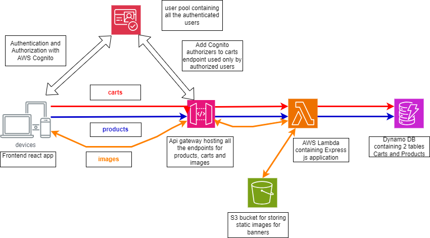
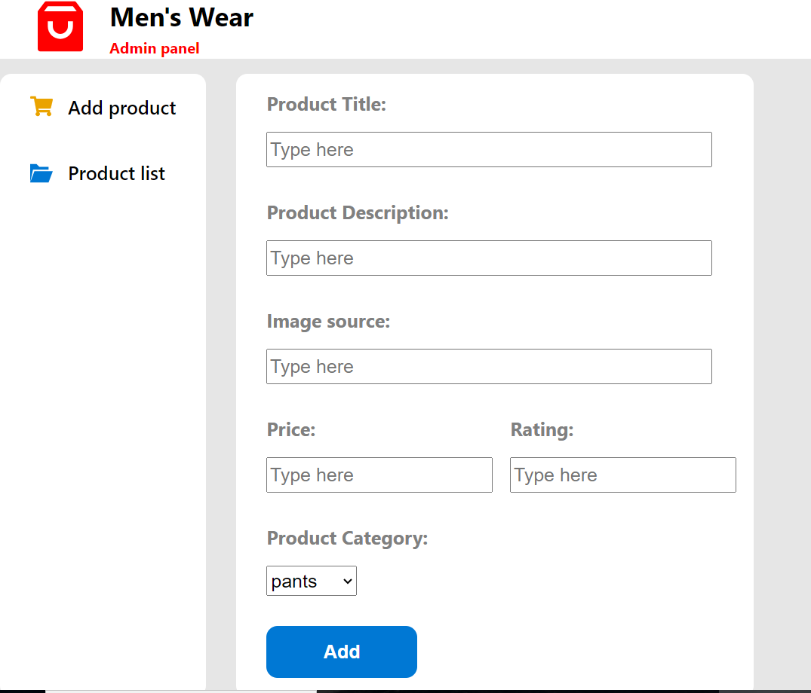
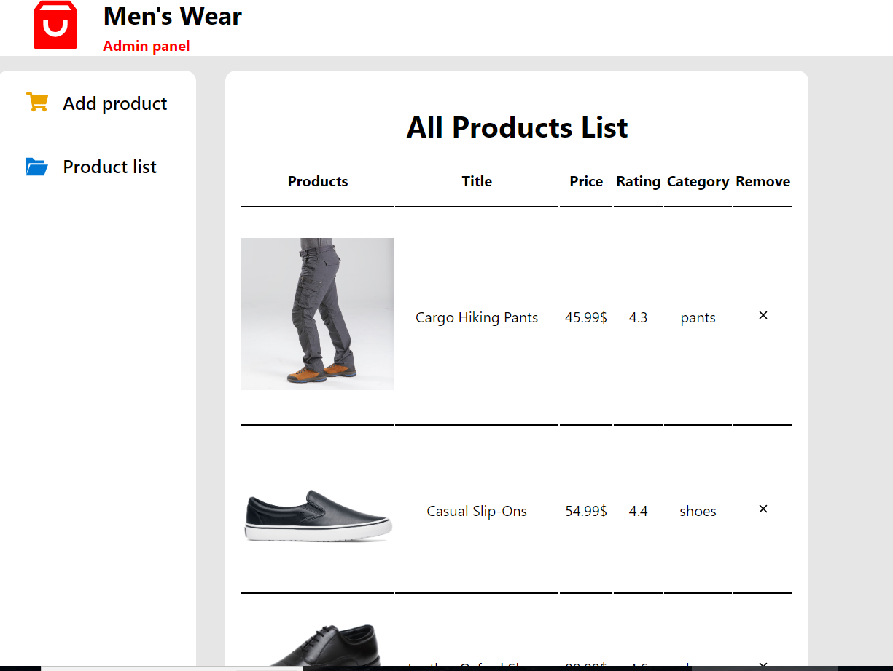

# Men's wear

This is an app for an e-commerce store for men where you can shop for pants, shirts and shoes.

The goal of the project was to create a fullstack application which involves the use of many AWS cloud services.

## Functionalities

The project contains several functionalities:

1- Sign in, Sign up, Sign out

2- Displaying products by category

3- Displaying product details page and its similar products

4- Displaying cart list page after adding a specific product to cart

5- Displaying Admin page used only by the admin to add products and display products list.

## Tech stack

React, Typescript, Express js, Tailwind CSS, AWS Cognito, AWS S3, AWS DynamoDb, AWS Lambda, AWS APIGateway, AWS IAM.

## Basic Architecture

## System design

- The project's products and users carts are stored in AWS dynamoDb.

- All the Restful api endpoints are deployed in AWS API Gateway. When the client makes a request, the latter is being intercepted by AWS api gateway and then it is being transferred to the AWS lambda so that the Express js code can process and returns back the requested response.

- All the products and carts are being stored inside AWS dynamoDb tables. These tables primary key are there id.
  Couple of GSI's(global secondary indexes) are being created in order to reduce the number of RCU's used during the requests, especially when requesting products by category and the carts by the user id.

- In order to reduce the number of requests transferred to the server, some endpoints responses are being cached by the api gateway, like the endpoint for retrieving products by product id, or the carts by user id.

- All signed up users are being stores inside AWS cognito. This service is also used to create protected endpoints in Api gateway via the Authorizers add to these endpoints. This setting will link gateway to cognito,
  and with each request to a protected endpoint, gateway will check if the client is authorized to access to the protected resources.

- AWS S3 is used to store the banners images. In order to retrieve them, some policies where added to Lambda in order to gain access to S3 service.

## Link to project:

[Men's wear](https://main.dvj019rk5kh54.amplifyapp.com)

## Adding product form

## Product List

